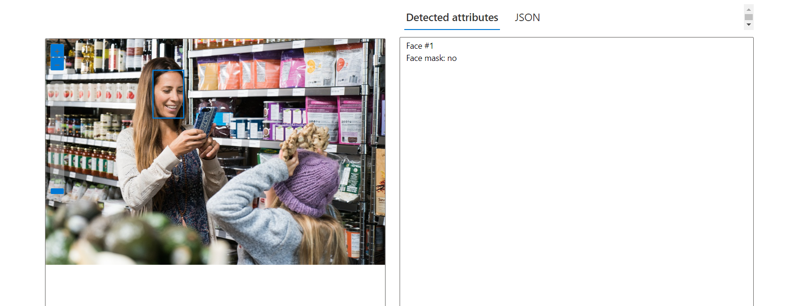
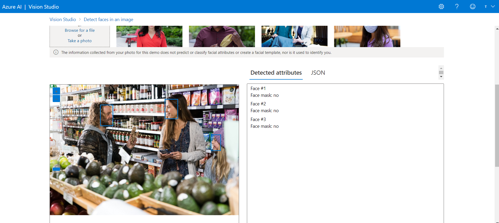

IVAN WAGNER

# Reconhecimento Facial e transformação de imagens em Dados no Azure ML

## Guia de Utilização do Azure Machine Learning

Este guia fornece instruções sobre como configurar e usar o Azure AI Services

### Passo 1: Criar e Configurar o Recurso de Serviços Congnitivos - Azure AI Services
1. Acesse o portal do Azure e clique em "Criar recurso".
2. Em Cartegorias, clique AI + Machine Learning 
3. Clique em "Serviços Cognitivos" (Azure AI services)
4. Configure os detalhes da área de trabalho e crie o recurso.

### Passo 2: Conecte o recurso ao Vision Studio
1. Acesse em outra aba do navegador o Vision Studio através do link https://portal.vision.cognitive.azure.com

## Detecção de faces no Vision Studio no Azure

O Vision Studio no Azure é uma ferramenta online que permite testar e explorar os recursos de visão computacional do Azure, incluindo a detecção de faces. A detecção de faces é a ação de localizar rostos humanos em uma imagem e a possibilidade de retornar diferentes tipos de dados relacionados ao rosto, pontos de referência, entre outros.

### Resultados
Foram utilizadas as imagens fornecidas no link https://aka.ms/mslearn-detect-faces

## Como usar a API Análise de Imagem para reconhecimento de caracteres

A API Análise de Imagem pode detectar texto em imagens e gerar um fluxo de caracteres para cada linha de texto detectada. Para usar essa API, você precisa incluir `Ocr` no parâmetro de consulta `visualFeatures`. Em seguida, quando receber a resposta JSON completa, basta analisar a cadeia de caracteres para o conteúdo da seção `regions`.

### Resultados

## Como adicionar legendas às imagens no Vision Studio da Azure

O recurso de legendas de imagem permite que você crie descrições curtas e informativas para as imagens que você envia para a API de Análise de Imagem. As legendas de imagem podem tornar suas imagens mais compreensíveis e acessíveis, especialmente para pessoas que usam tecnologias assistivas, como leitores de tela.

### Entre em contato:
 
